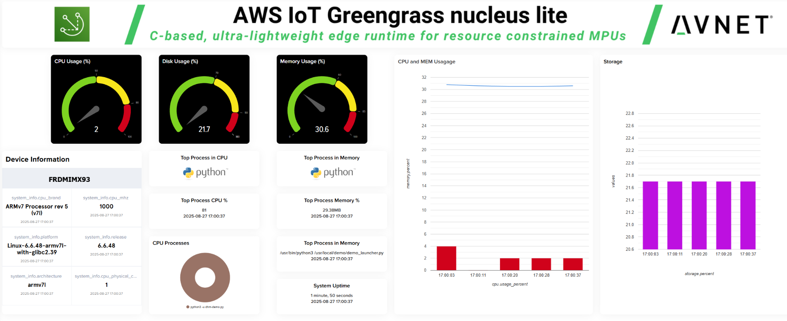

> [!TIP]
> To setup and connect this device using the **/IOTCONNECT Python Lite SDK**, refer to this [QuickStart Guide](https://github.com/avnet-iotconnect/iotc-python-lite-sdk-demos/tree/main/nxp-frdm-imx-93).

# NXP FRDM i.MX 93 AWS IoT Greengrass nucleus lite QuickStart
[Purchase the FRDM i.MX 93 Board](https://export.farnell.com/nxp/frdm-imx93/frdm-development-board-for-i-mx/dp/4626785)  


1. [Introduction](#1-introduction)
2. [Requirements](#2-requirements)

   * [Hardware](#hardware)
   * [Software](#software)
3. [Hardware Setup](#3-hardware-setup)
4. [/IOTCONNECT: Cloud Account Setup](#4-iotconnect-cloud-account-setup)
5. [/IOTCONNECT: Import the Device Template](#5-iotconnect-import-the-device-template)
6. [/IOTCONNECT: Create the Greengrass Device](#6-iotconnect-create-the-greengrass-device)
7. [Download and Write the Image](#7-download-and-write-the-image)
8. [Configure the Device](#8-configure-the-device)

   * [Obtain the IP Address](#obtain-the-ip-address)
   * [Transfer the Device Information](#transfer-the-device-information)
   * [Run the Setup Script](#run-the-setup-script)
9. [Deploy the Greengrass Component](#9-deploy-the-greengrass-component)

   * [Load the Recipe](#load-the-recipe)
   * [Load the Artifact](#load-the-artifact)
   * [Create Package](#create-package)
   * [Deploy Package](#deploy-package)
10. [Import a Dynamic Dashboard](#10-import-a-dynamic-dashboard)
11. [Resources](#11-resources)

## 1. Introduction
This guide will walk through the steps to create and demonstrate a Device Health Monitoring application solution on the 
NXP FRDM i.MX 93.  The solution utilizes the AWS Greengrass nucleus lite. Avnet's /IOTCONNECT platform will also be used 
to streamline all actions that would otherwise be performed in the AWS Console. The main tasks that will be performed are 
as follows:  

1. Create an /IOTCONNECT account
2. Import an example **Device Template** in /IOTCONNECT
3. Create a **Greengrass Device** in /IOTCONNECT
4. Setup **nucleus lite** on the target device
5. Download and Register a pre-built **Greengrass Component** in /IOTCONNECT
6. Create a **Deployment** package that defines the **Greengrass Components** deployed to the nucleus
7. Deploy the **Component** to the target device
8. View live data and interact with the target device using **Dynamic Dashboards** in /IOTCONNECT

## 2. Requirements
This guide has been written and tested to work on a Windows 10/11 PC to reach the widest audience.

### Hardware 
* NXP FRDM i.MX 93 [Purchase](https://www.avnet.com/shop/us/products/nxp/frdm-imx93-3074457345660216004/) | [User Manual & Kit Contents](https://docs.nxp.com/bundle/UM12181/page/topics/frdm-imx93_overview.html) | [All Resources](https://www.nxp.com/design/design-center/development-boards-and-designs/FRDM-IMX93)
* 2 USB Type-C Cables (included)
* Ethernet Cable

### Software
* A serial terminal such as [TeraTerm](https://github.com/TeraTermProject/teraterm/releases) or [PuTTY](https://www.putty.org/)
* Disk image writing software such as [BalenaEtcher](https://etcher.balena.io/)

## 3. Hardware Setup
Make the following connections using the image below as reference:

1. Connect an Ethernet cable from your LAN (router/switch) to the Ethernet connector labeled **#1**. If you instead wish
   to use Wi-Fi, after booting your board refer to the [WIFI](https://github.com/avnet-iotconnect/iotc-python-lite-sdk-demos/blob/main/nxp-frdm-imx-93/WIFI.md) guide.
2. Connect one of the included USB cables from your PC to the USB-C connector labeled **#2**.
3. Connect the other included USB cable from your PC to the USB-C connector labeled **#3**.

See the reference image below for cable connections:  


## 4. /IOTCONNECT: Cloud Account Setup
An /IOTCONNECT account with an AWS backend is required.  If you need to create an account, a free trial subscription is available.
The free subscription may be obtained directly from [iotconnect.io](https://iotconnect.io) or through the AWS Marketplace.

* Option #1 (Recommended) /IOTCONNECT via [AWS Marketplace](https://github.com/avnet-iotconnect/avnet-iotconnect.github.io/blob/main/documentation/iotconnect/subscription/iotconnect_aws_marketplace.md) - 60 day trial; AWS account creation required
* Option #2 /IOTCONNECT via [iotconnect.io](https://subscription.iotconnect.io/subscribe?cloud=aws) - 30 day trial; no credit card required

> [!NOTE]
> Be sure to check any SPAM folder for the temporary password after registering.

## 5. /IOTCONNECT: Import the Device Template
1. Download the pre-made Device Template: [all-apps-device-template.json](https://github.com/avnet-iotconnect/iotc-python-greengrass-sdk/blob/main/examples/common/files/all-apps-device-template.json)
   
2. Log into your /IOTCONNECT account at [console.iotconnect.io](https://console.iotconnect.io/login)
   
3. Using the Sidebar menu in /IOTCONNECT, navigate to *Device -> Greengrass Device -> Template (bottom menu)*


4. Click on the **Create Template** button and then the **Import** button and browse to select the device template .json file.


## 6. /IOTCONNECT: Create the Greengrass Device
1. At the bottom of the /IOTCONNECT GUI, click the **Devices**


2. At the top-right, click **Create Device**


3. Enter a custom **Unique ID** and **Device Name** such as `FRDMIMX93` (Unique ID and Device Name must match)
> [!IMPORTANT]
> The Unique ID must be less than 14 characters, and be alphanumeric (non-endcap hyphens allowed).
4. Select the **Entity** to put the device in (For new accounts, there is only one option)  
5. Select `ggsdkdemo` for the **Template**  
6. Select `Nucleus Lite` for the **Device Type**
7. Click **Save & View**


8. Download the "Connection Kit" by clicking the icon in the upper right of the device page.  Save this file as `connectionKit.zip`.  
This contains information about the device which will be used to configure the board in a future step.


## 7. Download and Write the Image
Follow [the flashing guide for this board](https://github.com/avnet-iotconnect/iotc-python-lite-sdk-demos/blob/main/nxp-frdm-imx-93/FLASHING.md) 
to download and install a compatible Yocto image.

## 8. Configure the Device
Configuration of the device is mostly automated by using a device setup script, but first the device information bundle needs to be transferred to the board.
The steps required are as follows:
1. Obtain the IP address of the board
2. Transfer the device information to the board
3. Run the setup script

### Obtain the IP Address
* Connect to the board using a serial terminal, such as TeraTerm, and use the command `ifconfig`
* The IP Address will be listed next to the interface `end0`
* Leave the serial terminal window open for a future step

### Transfer the Device Information
* Navigate to the directory where the Connection Kit ("connectionKit.zip") was saved.
* **Right-Click** and select **Open in Terminal**
* Copy/Paste the following command replacing x.x.x.x with the IP address of the board
```commandline
scp connectionKit.zip root@x.x.x.x:
```

### Run the Setup Script
* Return to the TeraTerm window.
* Copy/Paste the following command to download the setup script and execute it.
```commandline
wget https://raw.githubusercontent.com/avnet-iotconnect/iotc-python-greengrass-sdk/refs/heads/main/installer/imx/device-setup.sh -O device-setup.sh
```

* Once the script has completed, use the following command to configure the device information:
```bash
bash device-setup.sh ~/connectionKit.zip
```
> [!NOTE]
> This script will set up the development environment and precompile Python packages and may take around 7 minutes.

* **REBOOT the Board**

## 9. Deploy the Greengrass Component
To deploy the pre-built component, we'll use /IOTCONNECT to create a deployment package that contains the artifact file and a recipe.
* **Download** and **Extract** the *Device Health Monitoring Component*: [iotc-gg-component-dhm-demo-1.0.0.zip](https://downloads.iotconnect.io/greengrass/components/iotc-gg-component-dhm-demo-1.0.0.zip)

### Load the Recipe
1. In the /IOTCONNECT platform, click **Package** at the bottom of the screen, then click **Components** at the top.


2. In the "Create Component" box, browse for the recipe file ("recipe.yaml") from the previously extracted component archive here:  `<your working directory>\iotc-gg-component-dhm-demo-1.0.0\dhm-demo\greengrass-build\recipes\recipe.yaml`

### Load the Artifact 
1. Click the icon to the right of "dhm-demo.zip" and navigate to the dhm-demo.zip from the previously extracted archive here: `<your working directory>\iotc-gg-component-dhm-demo-1.0.0\dhm-demo\greengrass-build\artifacts\io.iotconnect.example.IotConnectSdkDhmDemo\1.0.0\dhm-demo.zip`
2. Click **Save**

### Create Package
1. Verify the component is now list and at the top-right, click **Package**


2. Enter a *Name* such as `MyDHMdemo`
3. Select the `ggsdkdemo` Template
4. Select the **Custom Component** in the drop-down

5. Click **Save**

### Deploy Package
1. **Click** **Deploy**


2. Add a *Name* and select each item in the drop-downs (there will only be one option for each)
3. Ensure you tick the box under "Components" and pick the version `1.0.0`
4. **Click** *Deploy*


The package with the component is now being deployed to the device.

This process can take 5min or more, so wait until you see "Success" in the Deployment History.

## 10. Import a Dynamic Dashboard
/IOTCONNECT Dynamic Dashboards are an easy way to visualize data and interact with edge devices.  
* Download the *Device Health Monitoring* dashboard: [greengrass-nucleus-lite-dashboard.json](../greengrass-nucleus-lite-dashboard.json)

* Switch back to the /IOTCONNECT browser window and verify the device status is displaying as `Connected`
* **Click** `Create Dashboard` from the top of the page
* **Select** the `Import Dashboard` option and **Click** *Browse* to select the dashboard template previously downloaded.
* **Select** the *Template* ("ggsdkdemo") and your *Device Name*
* **Enter** a name (such as `My STM32MP157F Greengrass Dashboard`) and **Click** *Save* the finalize the import

You will now be in the dashboard edit mode. You can add/remove widgets or just click `Save` in the upper-right corner to 
exit the edit mode.



## 11. Resources
* Explore connecting the NXP FRDM i.MX 93 through the Python Lite SDK [QuickStart](https://github.com/avnet-iotconnect/iotc-python-lite-sdk-demos/tree/main/nxp-frdm-imx-93)
* Try out the other available [greengrass lite components](https://github.com/avnet-iotconnect/iotc-python-greengrass-sdk/tree/main/examples)
* Learn more and develop your own components: [iotc-python-greengrass-sdk](https://github.com/avnet-iotconnect/iotc-python-greengrass-sdk)
* [Purchase the FRDM i.MX 93 Board](https://export.farnell.com/nxp/frdm-imx93/frdm-development-board-for-i-mx/dp/4626785)
* [More /IOTCONNECT ST Guides](https://avnet-iotconnect.github.io/partners/st/)
* [/IOTCONNECT Overview](https://www.iotconnect.io/)
* [/IOTCONNECT Knowledgebase](https://help.iotconnect.io/)
