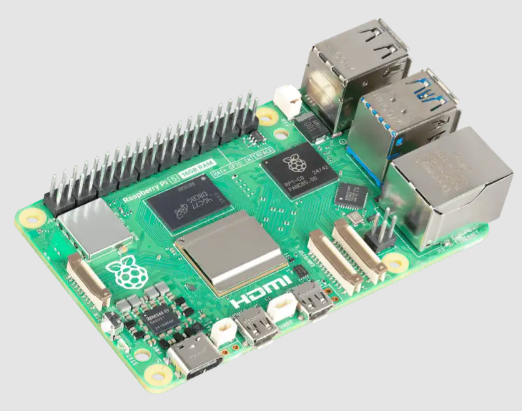
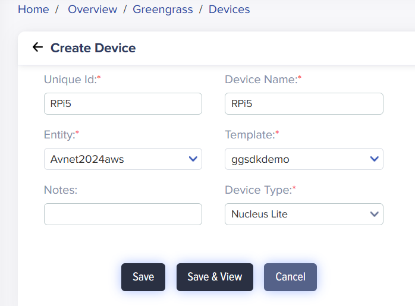
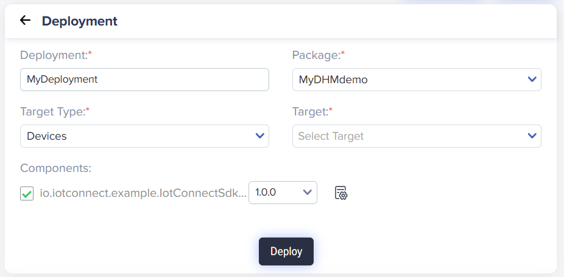

> [!TIP]
> To set up and connect this device using the **/IOTCONNECT Python Lite SDK**, refer to this [QuickStart Guide](https://github.com/avnet-iotconnect/iotc-python-lite-sdk-demos/tree/main/raspberry-pi)

# Raspberry Pi AWS IoT greengrass nucleus lite QuickStart
  

## 1. Introduction
This guide will walk through the steps to create and demonstrate a Device Health Monitoring application solution on a Raspberry Pi 5.  The solution utilizes the AWS greengrass nucleus lite. Avnet's /IOTCONNECT platform will also be used to streamline all actions that would otherwise be performed in the AWS Console. The main tasks that will be performed are as follows:  

1. Create an /IOTCONNECT account
2. Import an example **Device Template** in /IOTCONNECT
3. Create a **greengrass Device** in /IOTCONNECT
4. Setup **nucleus lite** on the target device
5. Download and Register a pre-built **greengrass Component** in /IOTCONNECT
6. Create a **Deployment** package that defines the **greengrass Components** deployed to the nucleus
7. Deploy the **Component** to the target device
8. View live data and interact with the target device using **Dynamic Dashboards** in /IOTCONNECT

## 2. Requirements
This guide has been written and tested to work on a Windows 10/11 PC to reach the widest audience.

### Hardware 
* Raspberry Pi (5 recommended) [Purchase](https://www.newark.com/raspberry-pi/rpi5-4gb-single/rpi-5-board-2-4ghz-4gb-arm-cortex/dp/81AK1346)
* MicroSD Card (32GB or larger) and adapter for connection to PC
* USB Type-C Power Cable
* USB Keyboard
* micro-HDMI to HDMI Cable
* Monitor OR [HDMI to USB Adapter](https://www.amazon.com/s?k=hdmi+to+usb+capture)
* Ethernet Cable

### Software
* Raspberry Pi Imager [Raspberry Pi Imager](https://www.raspberrypi.com/software/)

## 3. /IOTCONNECT: Cloud Account Setup
An /IOTCONNECT account with an AWS backend is required.  If you need to create an account, a free trial subscription is available.
The free subscription may be obtained directly from [iotconnect.io](https://iotconnect.io) or through the AWS Marketplace.

* Option #1 (Recommended) /IOTCONNECT via [AWS Marketplace](https://github.com/avnet-iotconnect/avnet-iotconnect.github.io/blob/main/documentation/iotconnect/subscription/iotconnect_aws_marketplace.md) - 60 day trial; AWS account creation required
* Option #2 /IOTCONNECT via [iotconnect.io](https://subscription.iotconnect.io/subscribe?cloud=aws) - 30 day trial; no credit card required

> [!NOTE]
> Be sure to check any SPAM folder for the temporary password after registering.

## 4. /IOTCONNECT: Import the Device Template

Login to the /IOTCONNECT platform: [console.iotconnect.io](https://console.iotconnect.io)

1. Download the pre-made Device Template: [all-apps-device-template.json](https://github.com/avnet-iotconnect/iotc-python-greengrass-sdk/blob/main/examples/common/files/all-apps-device-template.json)
2. Using the Sidebar menu in /IOTCONNECT, Navigate to *Device -> Greengrass Device -> Template (bottom menu)*.


3. Click on the **Create Template** button and then the **Import** button and browse to select the device template .json file.


## 5. /IOTCONNECT: Create the greengrass Device
1. At the bottom of the /IOTCONNECT GUI, click the **Devices**


2. At the top-right, click **Create Device**


3. Enter `RPi5` for the **Unique ID** and **Device Name**  
> [!IMPORTANT]
> The Unique ID must be less than 14 characters.
4. Select the **Entity** to put the device in (For new accounts, there is only one option)  
5. Select `ggsdkdemo` for the **Template**  
6. Select `Nucleus Lite` for the **Device Type**  


7. Click **Save & View**  
8. Download the "Connection Kit" by clicking the icon in the upper right of the device page.  Save this file as `connectionKit.zip` .  This contains information about the device which will be used to configure the board in a future step.


## 6. Hardware Setup
### Flash the micro SD Card
1. **Insert** the **micro SD card** into your computer or use an adapter.
2. **Open** the **Raspberry Pi Imager** application
3. **Select** the **version** of the target Raspberry Pi (5)
4. Click **Choose OS** and select **"Other general-purpose OS"**, **"Ubuntu"** then **"Ubuntu Server 24.04.3 LTS"**
5. Select the micro SD card for storage and click "Next"
6. When prompted, select the option for **"OS Customisation"**
7. Set a non-root username eg `demo` and password eg `demo`
8. Optionally, set your wireless LAN information.
9. On the **Services** tab, **Enable SSH** and **"Use password authentication"**
10. Accept the warning prompts and flash the image.

**Once the Flashing is complete, insert the SD card into the Raspberry Pi and continue to the next step.**

### Make Connections
Make the following connections:
1. Connectivity: Connect an **Ethernet Cable** from your LAN (modem/router/switch) to the Ethernet connector.
2. Display: Using the micro-HDMI to HDMI cable, connect the RPi to a monitor.
3. Input: Connect the USB Keyboard
4. Power: Connect the **Power cable** to the **USB-C Port** on the board.

## 7. Configure the Device
Configuration of the device is mostly automated by using a device setup script, but first the device information bundle needs to be transferred to the board.
The steps required are as follows:
1. Obtain the IP address of the board
2. Transfer the device information to the board
3. Download the Setup Script
3. Execute the Setup script

### Obtain the IP Address
* Login to the Raspberry Pi using the credentials entered in Raspberry Pi Imager (eg `demo`, `demo`)
* Type `ip a` to list the interfaces
* The IP Address will listed next to the interface `eth0` for Ethernet or `wlan0` for Wireless

### Transfer the Device Information
* Navigate to the directory where the Connection Kit ("connectionKit.zip") was saved.
* **Right-Click** and select **Open in Terminal**
* Copy/Paste the following command replacing `x.x.x.x` with the IP address of the board and `demo` if you used a different username.
```commandline
scp connectionKit.zip demo@x.x.x.x:
```
**The next 2 commands need to be performed while connected to the RPi via SSH**
Enter the following command, again replacing the IP address:
```commandline
ssh demo@x.x.x.x
```

Copy/Paste the following commands into the SSH session:
### Download the Setup Script
```bash
wget https://raw.githubusercontent.com/avnet-iotconnect/iotc-python-greengrass-sdk/refs/heads/main/installer/ubuntu/device-setup.sh -O device-setup.sh
```

### Execute the Setup Script
```commandline
sudo bash device-setup.sh ~/connectionKit.zip
```

> [!NOTE]
> This script will set up the development environment and precompile Python packages and may take around 7 minutes.

## 8. Deploy the Greengrass Component
To deploy the pre-built component, we'll use /IOTCONNECT to create a deployment package that contains the artifact file and a recipe.
* **Download** and **Extract** the *Device Health Monitoring Component*: [iotc-gg-component-dhm-demo-1.0.0.zip](https://downloads.iotconnect.io/greengrass/components/iotc-gg-component-dhm-demo-1.0.0.zip)

### Load the Recipe
1. In the /IOTCONNECT platform, click **Package** at the bottom of the screen, then click **Components** at the top.


2. In the "Create Component" box, browse for the recipe file ("recipe.yaml") from the previously extracted component archive here:
```
<your working directory>\iotc-gg-component-dhm-demo-1.0.0\dhm-demo\greengrass-build\recipes\recipe.yaml
```

### Load the Artifact 
1. Click the icon to the right of "dhm-demo.zip" and navigate to the dhm-demo.zip from the previously extracted archive here:
```
<your working directory>\iotc-gg-component-dhm-demo-1.0.0\dhm-demo\greengrass-build\artifacts\io.iotconnect.example.IotConnectSdkDhmDemo\1.0.0\dhm-demo.zip
```
2. Click **Save**

### Create Package
1. Verify the component is now list and at the top-right, click **Package**


2. Enter a *Name* such as `MyDHMdemo`
3. Select the `ggsdkdemo` Template
4. Select the only option in the **Custom Component** drop-down
5. Click **Save**

### Deploy Package
1. **Click** **Deploy**


2. Add a *Name* and select each item in the drop-downs (there will only be one option for each)
3. Ensure you tick the box under "Components" and pick the version `1.0.0`
4. **Click** *Deploy*


The package with the component is now being deployed to the device.

This process can take 5min or more, so wait until you see "Success" in the Deployment History.

## 9. Import a Dynamic Dashboard
/IOTCONNECT Dynamic Dashboards are an easy way to visualize data and interact with edge devices.  
* Download the *Device Health Monitoring* dashboard: [greengrass-nucleus-lite-dashboard.json](../greengrass-nucleus-lite-dashboard.json)

1. Switch back to the /IOTCONNECT browser window and verify the device status is displaying as `Connected`
2. Click **Create Dashboard** from the top of the page
3. Select the **Import Dashboard** option and click **Browse** to select the dashboard template previously downloaded.
4. Select the **Template** `ggsdkdemo` and your **Device Name**
5. Enter a name such as `My DHM Dashboard` and click **Save** the finalize the import

You will now be in the dashboard edit mode. You can add/remove widgets or just click **Save** in the upper-right corner to exit the edit mode.


## Resources
* Try out the other available [greengrass lite components](https://github.com/avnet-iotconnect/iotc-python-greengrass-sdk/tree/main/examples)
* Learn more and develop your own components: [iotc-python-greengrass-sdk](https://github.com/avnet-iotconnect/iotc-python-greengrass-sdk)
* [/IOTCONNECT Overview](https://www.iotconnect.io/)
* [/IOTCONNECT Knowledgebase](https://help.iotconnect.io/)
